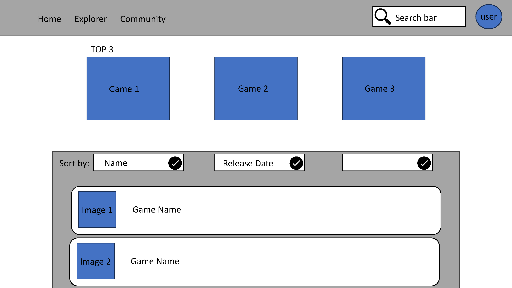
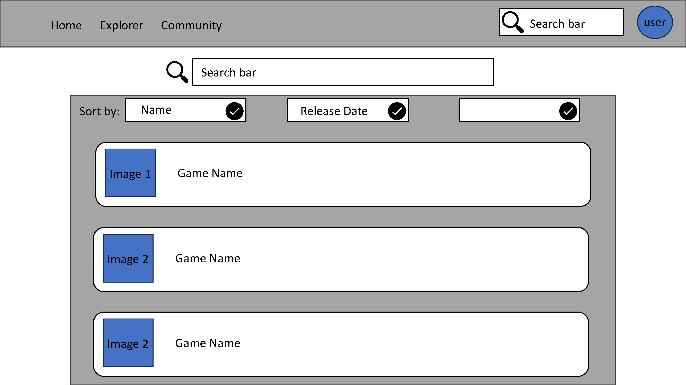
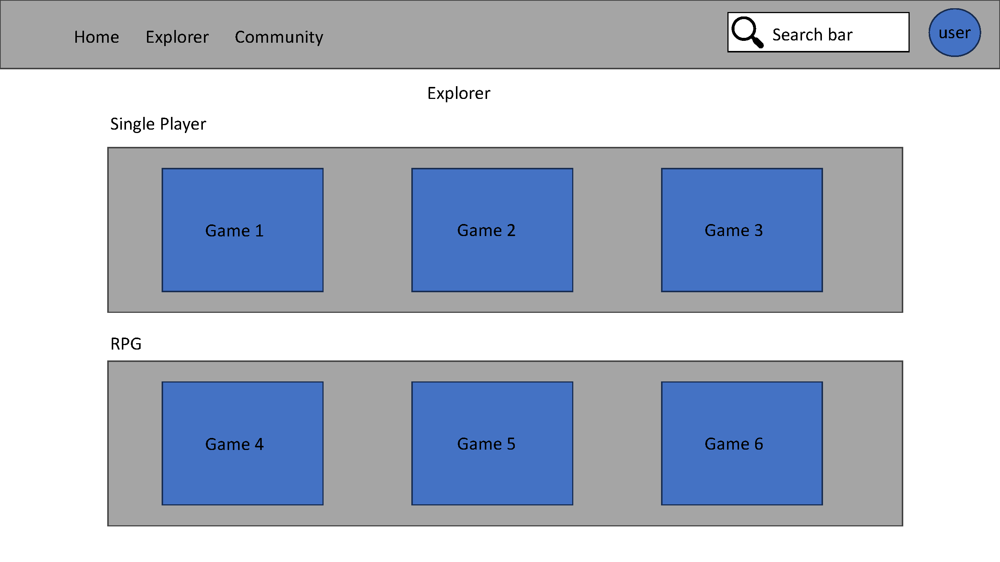
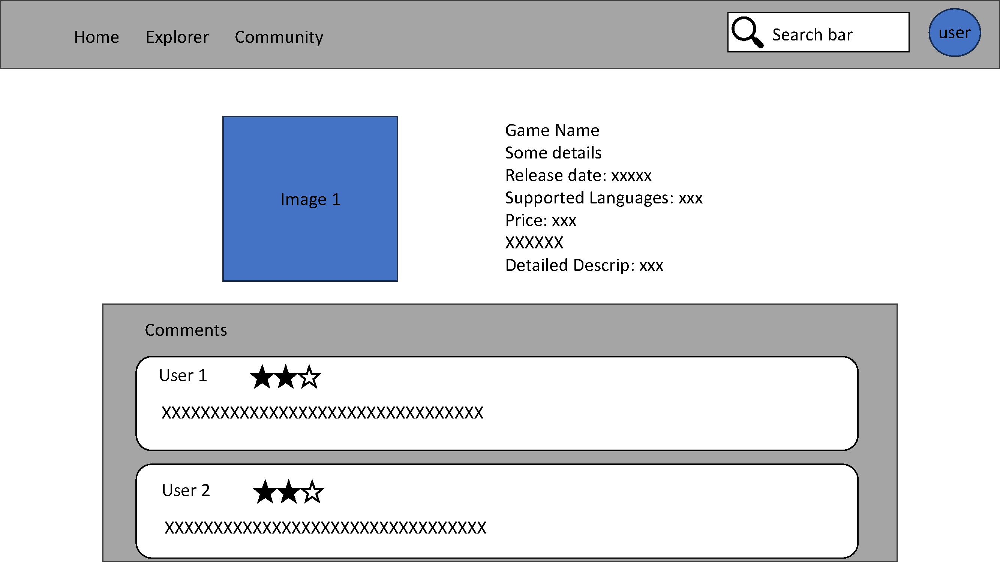
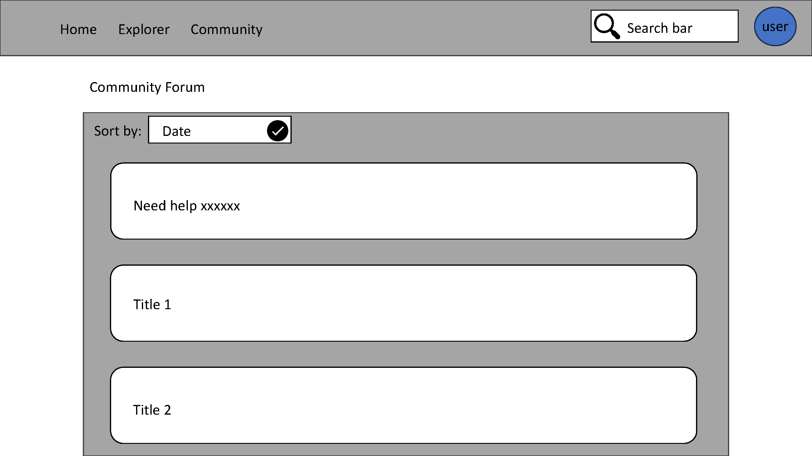

# SteamInsight

> Steam Game Analytics and Recommendation Platform

## Project Summary

The Steam Game Analytics and Recommendations Platform is a comprehensive system designed to meet the needs of the growing gaming community on the Steam platform. Our app is designed to provide users with a detailed analysis of the various games available on Steam, and users can either browse the list as a whole or sort their own search by trends, user recommendations, and different game attributes such as genre, release date, and popularity metrics. In addition, the platform will be equipped with a recommendation system to help users discover new games based on their preferences and gaming history. The project aims to enhance the gaming experience by providing a centralized platform where users can access detailed analysis and more effectively find their next favorite game.

## Description

We plan to develop an integrated system, the primary goal of which is to simplify and personalize the game selection process for players, while providing developers and platform administrators with a powerful game information management tool.
The application will utilize the rich dataset available which consists of detailed information of around 13,357 games listed on the Steam platform. This dataset includes attributes such as game title, release date, genre, price, and various popularity metrics like Metacritic scores, player counts, and owner counts. 

Through this application, we can address the difficulties players face when choosing the appropriate games and offer recommendations, while also offering a centralized location to manage and update game information, ensuring that players can easily find all the information they need.

## Usefulness

Our application aims to fill the gap in the market for a centralized platform offering detailed analytics and recommendations for Steam games. While platforms like Steamdb.info and steamspy.com provide data on Steam games, they do not offer an integrated recommendation system or in-depth analytics presented in a user-friendly manner. 

Our application goes beyond merely presenting data by offering users insights into game trends and a personalized recommendation system, enhancing their ability to discover new games that align with their interests. Moreover, market analysts and developers can benefit from the analytical features of the platform, gaining insights into market trends and user preferences, helping them make informed decisions in their operations.

## Realness

The data for our application is sourced from publicly available Steam APIs and steamspy.com, which is a well-established platform providing data on Steam games. The dataset contains real and up-to-date information on various games listed on the Steam platform, ensuring the authenticity and realness of the data we will be utilizing for our application.

## Creative Component

1. **Community Integration**
   - **Forums and Discussion Boards**: Users can join community forums to discuss various game topics, share experiences, and seek advice or recommendations.

2. **Advanced Analytics and Visualization**
   - **Dynamic Dashboards**: Implement dynamic dashboards where users can customize the view of game statistics and analytics based on their preferences.

3. **User-Created Content and Guides**
   - **User Guides and Tutorials**: Users can create and share guides, tutorials, and tips for various games, helping others in the community.
   - **Content Rating and Reviews**: Users can rate and review the content created by others, encouraging quality content creation.

## Functionality

Our platform is designed to cater to two types of users: general users who are keen to explore and discover new games, and developers or market analysts who are looking for detailed analytics and insights into game trends. Regardless of the user type, our platform offers a rich set of functionalities, including:

1. **Explore Games**: Browse through a comprehensive list of games available on Steam,with detailed information on each game, including description, genre, release date, price, and popularity metrics，with the ability to filter and sort games based on various attributes such as genre, release date, and popularity metrics.

2. **Game Analytics**: Access detailed analytics on game trends, including popular genres, top-rated games, and emerging trends in the gaming community.

3. **User Account Management**: Create and manage their accounts, maintaining a history of their preferences and interactions with the application.

4. **Recommendation System**: Receive personalized game recommendations based on their preferences and gaming history.

5. **Reviews and Ratings**: View and write reviews and ratings for different games, helping future users make informed decisions.

## Low Fidelity UI Mockup

The UI will be designed to provide a user-friendly experience, with easy navigation and visually appealing representations of data.

#### Main Page

The main page serves as a gateway to all the features the SteamInsight platform offers. It showcases a dynamic blend of popular games, recent reviews, offering users a quick snapshot of what's trending in the Steam gaming community. A navigation bar at the top provides easy access to other sections of the site.

#### Search Page (with results)

The search page is a powerful tool that enables users to find games, community posts, or user profiles based on their queries. It features advanced filtering options to narrow down the results according to various parameters such as game genre, release date, or popularity metrics.

#### Games Explorer

This page acts as a vast repository where users can explore the extensive range of games available on Steam. Users can browse through different categories, including genres, top-rated games, new releases, and more. Each game thumbnail offers a quick overview of the title, including its rating and price.

#### Detailed Game Information

A dedicated page for each game where users can find detailed information, including a game's synopsis, genre, developer info, release date, and user reviews.

#### Community Forum

A bustling community space where users can engage in vibrant discussions, share personal experiences, or seek advice on gaming matters. This forum fosters a collaborative environment with sub-forums dedicated to different games, genres, or other gaming-related topics.

## Work Distribution

Our tentative work distribution is as follows:

- **Peter Zhu**: Responsible for developing the backend of the application, including database management and APIs.
- **Zoey Yao**: Responsible for developing the frontend of the application, focusing on UI/UX design and implementation.
- **Xing Zhao**: Responsible for implementing the recommendation system and integrating it with the application.
- **Eric Cheng**: Responsible for managing the project, coordinating between team members, and overseeing the overall development of the application.

