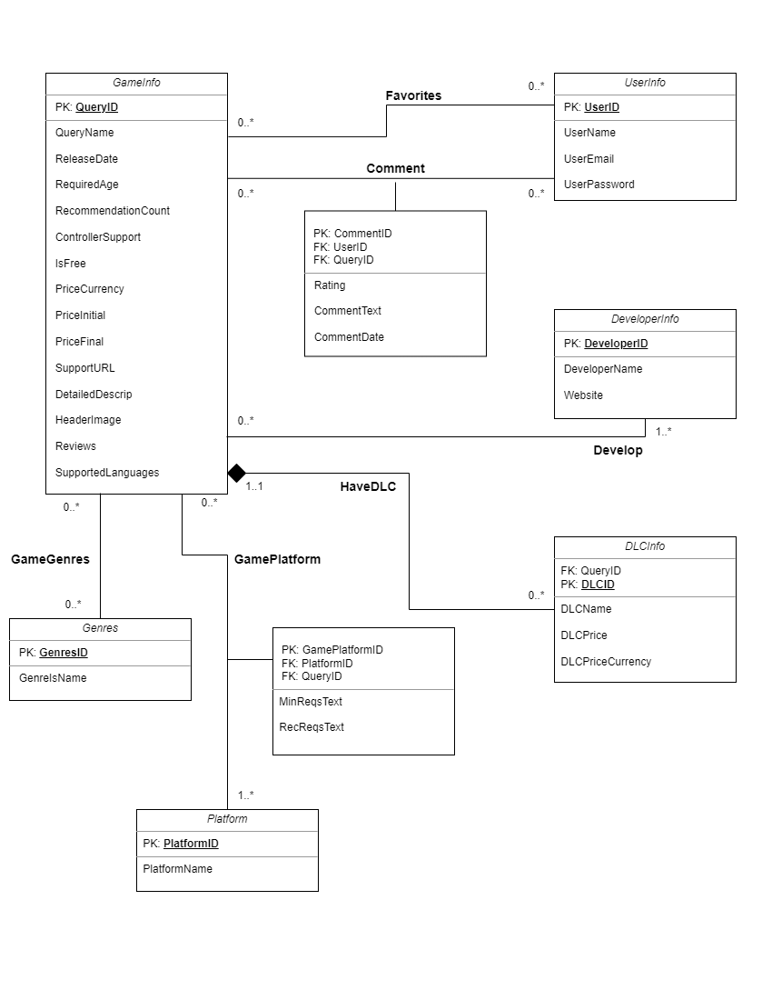

# Database conceptual design

## UML diagram




## Entities

There are a total of 6 entities for our database design. Each is explained in detail as follows.

### 1. GameInfo

This is an entity regarding game information, with 18 attributes.
 
1. **QueryID**: a unique identifier to distinguish between queries. This should be a numeric attribute and primary key for this table. 
2. QueryName: a string attribute, the name of the query.
3. ReleaseDate: a date attribute, the release date of the query.
4. RequiredAge: a numeric attribute, the required age for the query.
5. RecommendationCount: a numeric attribute, the number of recommendations for the query.
6. ControllerSupport: a boolean attribute, indicating whether the query supports controller input (TRUE) or not (FALSE).
7. IsFree: a boolean attribute, indicating whether the query is free (TRUE) or not (FALSE)
8. PriceCurrency: a string attribute, the type of currency for the query. This attribute can be NULL if IsFree is TRUE.
9. PriceInitial: a numeric attribute, the initial price of the query.
10. PriceFinal: a numeric attribute, the current price of the query.
11. SupportURL: a string attribute, the support URL for the query. This attribute can be NULL.
12. DetailedDescrip: a string attribute, the detailed description of the query. Most are descriptions, but this attribute can be NULL.
13. HeaderImage: a string attribute, the URL of the header image for the query.
14. Reviews: a string attribute, for game reviewers' comments. This attribute can be NULL.
15. SupportedLanguages: a string attribute, the supported languages for the query. Note that spaces should not be used as separators to avoid errors (e.g., "Simplified Chinese Traditional Chinese").

### 2. Genres

This is an entity regarding genre information.
1. **GenresID**:a unique identifier to distinguish between genres. This should be a numeric attribute and primary key for this table.
2. GenreName: Name of the genre.


### 3. Platform

This is an entity regarding platform information, with four attributes.

1. **PlatformID**:a unique identifier to distinguish between platforms. This should be a numeric attribute and primary key for this table.
2. PlatformName: a string attribute, the name of the platform. There are currently three choices: Windows, Linux, and Mac. 


### 4. DeveloperInfo

This is an entity regarding developer information, with three attributes.

1. **DeveloperID**: a unique identifier to distinguish between developers. This should be a string attribute and primary key for this table.
2. DeveloperName: a string attribute, the name of the developer.
3.  Website: a string attribute, the website associated with the developer. This attribute can be NULL, meaning it is optional and may not always have a value.


### 5. UserInfo

This is an entity regarding user login information, with four attributes.

1. **UserID**: a unique identifier to distinguish between users. This should be a string attribute and primary key for this table. NetId will serve as the username for login page.
2. UserName: a string attribute, the name of the user.
3. UserEmail: a string attribute, the email address of the user.
4. Password: a string attribute, password for login the platform.

This entity is designed according to the assumptions:
1. Every user in this platform will have a unique UserID and cannot be modified.
2. Users can change their password, which is the only allowed update operation for this entity table.
3. Once the user entered the UserName or UserEmail and Password, the system will automatically log in and to home page.

### 6. DLCInfo

This is an entity regarding DLC information, with five attributes.

1. **DLCID**: a unique identifier to distinguish between DLCs. This should be a string attribute and primary key for this table. This attribute will be generated by the system automatically.
2. QueryID: Foreign key to `GameInfo`, to identify the game which the DLC belongs to.
3. DLCName: a string attribute, the name of the DLC.
4. DLCPriceCurrency: a string attribute, the currency of the DLC price.
5. DLCPrice: an numeric attribute, the price of the DLC.


## Relations

There are a total of 6 relations in our database design, which will addressed in details as follows:

### 1. Favorites

`Favorites` is a relation between `UserInfo` and `GameInfo` to mark the favorite games of each user. This is a **many-to-many** relation, for each user can have multiple favorite games, and each game can be favorited by multiple users. However, we do have restrictions based on the following assumptions:
1. One user can only favorite the same game once. This is to ensure that `UserID` and `QueryID` combined can uniquely identify a favorite record.

The relation has the following attributes:
1. UserID: Foreign key to `UserInfo`, to identify the user who favorited the game.
2. QueryID: Foreign key to `GameInfo`, to identify the game which the user favorited.

### 2. Comments

`Comments` is a relation between `UserInfo` and `GameInfo` to mark the comments of each user on each game.This is a **many-to-many** relation, for each user can have multiple comments on multiple games, and each game can be commented by multiple users.

The relation has the following attributes:

1. CommentID: a unique identifier to distinguish between comments. This should be a string attribute and primary key for this table. This attribute will be generated by the system automatically.
2. CommentText: a string attribute, the content of the comment.
3. Rating: an integer attribute, the rating of the game given by the user. This should be an integer between 1 and 5.
4. CommentDate: a string attribute, the date when the comment is posted. This should be a string following the format of `YYYY-MM-DD`.
5. UserID: Foreign key to `UserInfo`, to identify the user who posted the comment.
6. QueryID: Foreign key to `GameInfo`, to identify the game which the comment is posted on.


### 3. Develop

`Develop` is a relation between `DeveloperInfo` and `GameInfo` to mark the games developed by each developer. This is a **many-to-many** relation, for each developer can develop 0 or more games, and each game can be developed by 1 or more developers.

The relation has the following attributes:
1. DeveloperID: Foreign key to `DeveloperInfo`, to identify the developer who developed the game.
2. QueryID: Foreign key to `GameInfo`, to identify the game which the developer developed.

### 4. GamePlatform

`GamePlatform` is a relation between `GameInfo` and `Platform` to mark the platforms that each game supports. This is a **many-to-many** relation, for each game can support 1 or more platforms, and each platform can be supported by 0 or more games. And for each game-platform pair, there can be a minimum requirements and a recommended requirements for the game to run on the platform.

The relation has the following attributes:
1. MinReqsText: a string attribute, the minimum requirements for the game to run on the platform. This attribute can be NULL.
2. RecReqsText: a string attribute, the recommended requirements for the game to run on the platform. This attribute can be NULL.
3. QueryID: Foreign key to `GameInfo`, to identify the game which the platform is supported by.
4. PlatformID: Foreign key to `Platform`, to identify the platform which the game supports.

### 5. GameGenres

`GameGenres` is a relation between `GameInfo` and `Genres` to mark the genres that each game belongs to. This is a **many-to-many** relation, for each game can belong to 0 or more genres, and each genre can have 0 or more games.

The relation has the following attributes:
1. QueryID: Foreign key to `GameInfo`, to identify the game which the genre belongs to.
2. GenresID: Foreign key to `Genres`, to identify the genre which the game belongs to.


### 6. HaveDLC

`HaveDLC` is a relation between `GameInfo` and `DLCInfo` to mark the DLCs that each game has. This is a **one-to-many** relation, for each game can have 0 or more DLCs, but each DLC can only belong to one game.

The relation has the following attributes:
1. DLCID: Foreign key to `DLCInfo`, to identify the DLC which the game has.
2. QueryID: Foreign key to `GameInfo`, to identify the game which the DLC belongs to.

## BCNF

#### Entities

1. **GameInfo**: This table is in BCNF as all attributes are functionally dependent on the primary key $ \text{QueryID} $ and there are no non-trivial functional dependencies that violate BCNF.

2. **Genres**: This table is in BCNF as it has only two attributes, and one of them is a primary key.

3. **Platform**: This table is in BCNF for the same reason as Genres.

4. **DeveloperInfo**: This table is in BCNF as all attributes are functionally dependent on the primary key $ \text{DeveloperID} $.

5. **UserInfo**: This table is in BCNF as all attributes are functionally dependent on the primary key $ \text{UserID} $.

6. **DLCInfo**: This table is in BCNF as all attributes are functionally dependent on the primary key $ \text{DLCID} $.

#### Relations

1. **Favorites**: This table is in BCNF as the combination of $ \text{UserID} $ and $ \text{QueryID} $ acts as a composite primary key, and there are no other attributes.

2. **Comments**: This table is in BCNF because every attribute is functionally dependent on the primary key $ \text{CommentID} $.

3. **Develop**: This table is in BCNF as the combination of $ \text{DeveloperID} $ and $ \text{QueryID} $ acts as a composite primary key, and there are no other attributes.

4. **GamePlatform**: This table is in BCNF as every attribute is functionally dependent on the composite primary key $ \text{QueryID} $ and $ \text{PlatformID} $.

5. **GameGenres**: This table is in BCNF as the combination of $ \text{QueryID} $ and $ \text{GenresID} $ acts as a composite primary key, and there are no other attributes.

6. **HaveDLC**: This table is in BCNF as all attributes are functionally dependent on the primary key $ \text{DLCID} $.


We chose to apply BCNF as it is stricter and ensures that all data dependencies make sense. All the tables and relations in your schema are already in BCNF, which means your database schema is highly normalized.

By adhering to BCNF, you ensure that the database schema has the following advantages:

1. Minimizes redundancy
2. Simplifies the enforcement of referential integrity constraints
3. Eases the data maintenance and ensures data integrity

## Relational Schema
The database design will be converted into 11 tables.

**1. UserInfo**

```mysql
UserInfo(
    UserID VARCHAR(255) [PK],
    UserName VARCHAR(255),
    UserEmail VARCHAR(255),
    Password VARCHAR(255)
)
```

**2. GameInfo**

```mysql
GameInfo(
    QueryID INT [PK],
    QueryName VARCHAR(255),
    ReleaseDate VARCHAR(255),
    RequiredAge INT,
    RecommendationCount INT,
    ControllerSupport BOOLEAN,
    IsFree BOOLEAN,
    PriceCurrency VARCHAR(255),
    PriceInitial REAL,
    PriceFinal REAL,
    SupportURL VARCHAR(255),
    DetailedDescrip VARCHAR(255),
    HeaderImage VARCHAR(255),
    Reviews VARCHAR(255),
    SupportedLanguages VARCHAR(255)
)
```

**3. Genres**

```mysql
Genres(
    GenresID INT [PK],
    GenreName VARCHAR(255)
)
```

**4. Platform**

```mysql
Platform(
    PlatformID INT [PK],
    PlatformName VARCHAR(255)
)
```

**5. DeveloperInfo**

```mysql
DeveloperInfo(
    DeveloperId INT [PK],
    DeveloperName VARCHAR(255),
    Website VARCHAR(255)
)
```

**6. Favorites**

```mysql
Favorites(
    UserID VARCHAR(255) [PK, FK to UserInfo.UserID],
    QueryID INT [PK, FK to GameInfo.QueryID]
)
```

**7. Comments**

```mysql
Comments(
    CommentID VARCHAR(255) [PK],
    CommentText VARCHAR(255),
    Rating INT,
    CommentDate VARCHAR(255),
    UserID VARCHAR(255) [FK to UserInfo.UserID],
    QueryID INT [FK to GameInfo.QueryID]
)
```

**8. Develop**

```mysql
Develop(
    DeveloperId INT [PK, FK to DeveloperInfo.DeveloperId],
    QueryID INT [PK, FK to GameInfo.QueryID]
)
```

**9. GamePlatform**

```mysql
GamePlatform(
    QueryID INT [PK, FK to GameInfo.QueryID],
    PlatformID INT [PK, FK to Platform.PlatformID],
    MinReqsText VARCHAR(255),
    RecReqsText VARCHAR(255)
)
```

**10. GameGenres**

```mysql
GameGenres(
    QueryID INT [PK, FK to GameInfo.QueryID],
    GenresID INT [PK, FK to Genres.GenresID]
)
```

**11. DLCInfo**

```mysql
DLCInfo(
    DLCID INT [PK],
    QueryID INT [FK to GameInfo.QueryID],
    DLCName VARCHAR(255),
    DLCPriceCurrency VARCHAR(255),
    DLCPrice INT
)
```


## MySQL DDL commands

```mysql
# Entities

CREATE TABLE UserInfo (
    UserID VARCHAR(255) PRIMARY KEY,
    UserName VARCHAR(255),
    UserEmail VARCHAR(255),
    Password VARCHAR(255)
);

CREATE TABLE GameInfo (
    QueryID INT PRIMARY KEY,
    QueryName VARCHAR(255),
    ReleaseDate DATE,
    RequiredAge INT,
    RecommendationCount INT,
    ControllerSupport BOOLEAN,
    IsFree BOOLEAN,
    PriceCurrency VARCHAR(255),
    PriceInitial DECIMAL(10,2),
    PriceFinal DECIMAL(10,2),
    SupportURL VARCHAR(255),
    DetailedDescrip TEXT,
    HeaderImage VARCHAR(255),
    Reviews TEXT,
    SupportedLanguages VARCHAR(255)
);

CREATE TABLE Genres (
    GenresID INT PRIMARY KEY,
    GenreName VARCHAR(255)
);

CREATE TABLE Platform (
    PlatformID INT PRIMARY KEY,
    PlatformName VARCHAR(255)
);

CREATE TABLE DeveloperInfo (
    DeveloperID INT PRIMARY KEY,
    DeveloperName VARCHAR(255),
    Website VARCHAR(255)
);

CREATE TABLE DLCInfo (
    DLCID INT PRIMARY KEY,
    QueryID INT,
    DLCName VARCHAR(255),
    DLCPriceCurrency VARCHAR(255),
    DLCPrice INT,
    FOREIGN KEY (QueryID) REFERENCES GameInfo(QueryID)
);

# Relationships

CREATE TABLE Favorites (
    UserID VARCHAR(255),
    QueryID INT,
    PRIMARY KEY (UserID, QueryID),
    FOREIGN KEY (UserID) REFERENCES UserInfo(UserID),
    FOREIGN KEY (QueryID) REFERENCES GameInfo(QueryID)
);

CREATE TABLE Comments (
    CommentID VARCHAR(255) PRIMARY KEY,
    CommentText TEXT,
    Rating INT CHECK (Rating BETWEEN 1 AND 5),
    CommentDate DATE,
    UserID VARCHAR(255),
    QueryID INT,
    FOREIGN KEY (UserID) REFERENCES UserInfo(UserID),
    FOREIGN KEY (QueryID) REFERENCES GameInfo(QueryID)
);

CREATE TABLE Develop (
    DeveloperID INT,
    QueryID INT,
    PRIMARY KEY (DeveloperID, QueryID),
    FOREIGN KEY (DeveloperID) REFERENCES DeveloperInfo(DeveloperID),
    FOREIGN KEY (QueryID) REFERENCES GameInfo(QueryID)
);

CREATE TABLE GamePlatform (
    QueryID INT,
    PlatformID INT,
    MinReqsText TEXT,
    RecReqsText TEXT,
    PRIMARY KEY (QueryID, PlatformID),
    FOREIGN KEY (QueryID) REFERENCES GameInfo(QueryID),
    FOREIGN KEY (PlatformID) REFERENCES Platform(PlatformID)
);

CREATE TABLE GameGenres (
    QueryID INT,
    GenresID INT,
    PRIMARY KEY (QueryID, GenresID),
    FOREIGN KEY (QueryID) REFERENCES GameInfo(QueryID),
    FOREIGN KEY (GenresID) REFERENCES Genres(GenresID)
);


```
