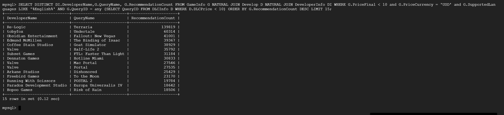
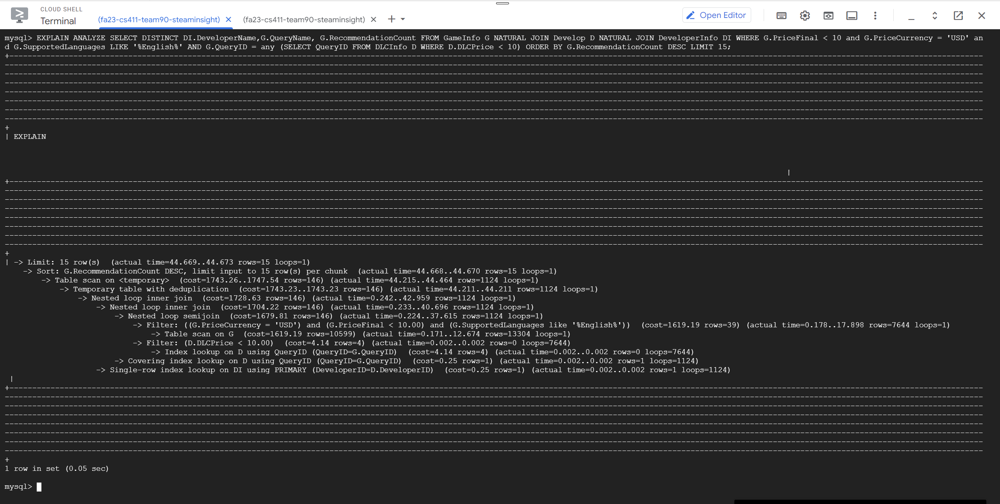

# Database Design

## Database Tables on GCP


three tables with at least 1000 rows:


## DDL Commands

```sql
CREATE DATABASE /*!32312 IF NOT EXISTS*/`classicmodels` /*!40100 DEFAULT CHARACTER SET latin1 */;

USE `classicmodels`;

-- User Info Table
DROP TABLE IF EXISTS `UserInfo`;
CREATE TABLE UserInfo (
    UserID INT PRIMARY KEY,
    UserName VARCHAR(255),
    UserEmail VARCHAR(255),
    UserPassword VARCHAR(255)
) ENGINE=InnoDB DEFAULT CHARSET=latin1;

-- Game Info Table
DROP TABLE IF EXISTS `GameInfo`;
CREATE TABLE GameInfo (
    QueryID INT PRIMARY KEY,
    QueryName VARCHAR(255),
    ReleaseDate VARCHAR(255),
    RequiredAge INT,
    RecommendationCount INT,
    ControllerSupport BOOLEAN,
    IsFree BOOLEAN,
    PriceCurrency VARCHAR(255),
    PriceInitial DECIMAL(10,2),
    PriceFinal DECIMAL(10,2),
    SupportURL VARCHAR(255),
    DetailedDescrip TEXT,
    HeaderImage VARCHAR(255),
    Reviews TEXT,
    SupportedLanguages VARCHAR(255)
) ENGINE=InnoDB DEFAULT CHARSET=latin1;

-- Developer Info Table
DROP TABLE IF EXISTS `DeveloperInfo`;
CREATE TABLE DeveloperInfo (
    DeveloperID INT PRIMARY KEY,
    DeveloperName VARCHAR(255),
    Website VARCHAR(255)
) ENGINE=InnoDB DEFAULT CHARSET=latin1;

-- DLC Info Table
DROP TABLE IF EXISTS `DLCInfo`;
CREATE TABLE DLCInfo (
    DLCID INT PRIMARY KEY,
    QueryID INT,
    DLCName VARCHAR(255),
    DLCPriceCurrency VARCHAR(255),
    DLCPrice DECIMAL(10,2),
    FOREIGN KEY (QueryID) REFERENCES GameInfo(QueryID)
        ON DELETE CASCADE ON UPDATE CASCADE
) ENGINE=InnoDB DEFAULT CHARSET=latin1;

-- Favorites Table
DROP TABLE IF EXISTS `Favorites`;
CREATE TABLE Favorites (
    UserID INT,
    QueryID INT,
    PRIMARY KEY (UserID, QueryID),
    FOREIGN KEY (UserID) REFERENCES UserInfo(UserID)
        ON DELETE CASCADE ON UPDATE CASCADE,
    FOREIGN KEY (QueryID) REFERENCES GameInfo(QueryID)
        ON DELETE CASCADE ON UPDATE CASCADE
) ENGINE=InnoDB DEFAULT CHARSET=latin1;

-- Comments Table
DROP TABLE IF EXISTS `Comments`;
CREATE TABLE Comments (
    CommentID INT PRIMARY KEY,
    CommentText TEXT,
    Rating INT CHECK (Rating BETWEEN 1 AND 5),
    CommentDate VARCHAR(255),
    UserID INT,
    QueryID INT,
    FOREIGN KEY (UserID) REFERENCES UserInfo(UserID)
        ON DELETE CASCADE ON UPDATE CASCADE,
    FOREIGN KEY (QueryID) REFERENCES GameInfo(QueryID)
        ON DELETE CASCADE ON UPDATE CASCADE
) ENGINE=InnoDB DEFAULT CHARSET=latin1;

-- Develop Table
DROP TABLE IF EXISTS `Develop`;
CREATE TABLE Develop (
    DeveloperID INT,
    QueryID INT,
    PRIMARY KEY (DeveloperID, QueryID),
    FOREIGN KEY (DeveloperID) REFERENCES DeveloperInfo(DeveloperID)
        ON DELETE CASCADE ON UPDATE CASCADE,
    FOREIGN KEY (QueryID) REFERENCES GameInfo(QueryID)
        ON DELETE CASCADE ON UPDATE CASCADE
) ENGINE=InnoDB DEFAULT CHARSET=latin1;

-- Game Platform Table
DROP TABLE IF EXISTS `GamePlatform`;
CREATE TABLE GamePlatform (
    QueryID INT,
    PlatformID INT,
    MinReqsText TEXT,
    RecReqsText TEXT,
    PlatformName VARCHAR(255),
    PRIMARY KEY (QueryID, PlatformID),
    FOREIGN KEY (QueryID) REFERENCES GameInfo(QueryID)
        ON DELETE CASCADE ON UPDATE CASCADE
) ENGINE=InnoDB DEFAULT CHARSET=latin1;

-- Game Genres Table
DROP TABLE IF EXISTS `GameGenres`;
CREATE TABLE GameGenres (
    QueryID INT,
    GenresID INT,
    GenreName VARCHAR(255),
    PRIMARY KEY (QueryID, GenresID),
    FOREIGN KEY (QueryID) REFERENCES GameInfo(QueryID)
        ON DELETE CASCADE ON UPDATE CASCADE
) ENGINE=InnoDB DEFAULT CHARSET=latin1;
```

## Advanced Queries

### Query 1

```sql
SELECT G.QueryID, G.QueryName
FROM GameInfo G
JOIN GameGenres Gen ON G.QueryID = Gen.QueryID
WHERE Gen.GenreName = 'Action'
AND G.DetailedDescrip IS NOT NULL
AND G.RecommendationCount > 10000
AND G.PriceInitial BETWEEN 10 AND 30
AND G.QueryID IN (
    SELECT QueryID
    FROM GamePlatform
    WHERE PlatformName IN ('Windows', 'Mac')
)
GROUP BY G.QueryID, G.QueryName;
```

It find all "Action" games and we add a constraint that the description and RecommendationCount is larger than 10000, and the price is between 10 and 30. Then, it finds out the games that are supported by PlatformWindows and PlatformMac.


### Query 2

```sql
SELECT DISTINCT DI.DeveloperName, G.QueryName, G.RecommendationCount
FROM GameInfo G NATURAL JOIN Develop D NATURAL JOIN DeveloperInfo DI
WHERE G.PriceFinal < 10 
  AND G.PriceCurrency = 'USD' 
  AND G.SupportedLanguages LIKE '%English%' 
  AND G.QueryID = ANY (
    SELECT QueryID
    FROM DLCInfo D
    WHERE D.DLCPrice < 10
)
ORDER BY G.RecommendationCount DESC
LIMIT 15;
```

This SQL query selects unique combinations of developer names, game query names, and the count of recommendations from three tables: GameInfo, Develop, and DeveloperInfo, joined together using natural joins. The results are filtered to include only games that cost less than 10 USD, are supported in English, have a developer with a listed website, and have associated downloadable content (DLC) that costs less than 10 USD. The results are then ordered by the number of recommendations in descending order, with the top 15 results displayed.



## Index Analysis

### Query 1

Default Index:


We added an index on RecommendationCount by using:

```sql
mysql> CREATE INDEX idx_rec_count ON GameInfo (RecommendationCount);
Query OK, 0 rows affected (0.19 sec)
Records: 0  Duplicates: 0  Warnings: 0
```

We chose to create an index on the RecommendationCount attribute of the GameInfo table because this field is used in a filtering condition within the WHERE clause of the query, and indexing it could potentially speed up this frequently-used query by reducing the number of rows that need to be scanned.

After implementing the index, the EXPLAIN ANALYZE output shows drastic improvements:

- The actual time for the operation reduced to between 0.036 to 1.446 seconds, which is much faster than before.
- The query now performs an "Index range scan" on GameInfo using idx_rec_count, which is more efficient than a full table scan.

In terms of the query plan, the cost associated with the scan on GameInfo also decreased from 1619.19 to 125.80, which is indicative of the reduced computational overhead.


We added an index on GenreName by using:

```sql
mysql> CREATE INDEX idx_gamegenres_genre_query ON GameGenres (GenreName);
Query OK, 0 rows affected (0.46 sec)
Records: 0  Duplicates: 0  Warnings: 0
```

we can observe from the EXPLAIN ANALYZE:

- Actual Time: The actual time increased slightly from 18.804 to 21.004 seconds.
- Cost: The cost increased from 1976.56 to 2000.18.

Findings and Explanation

- No Improvement: Contrary to expectations, the performance did not improve. In fact, the query execution time and cost slightly increased.

- Reason for No Improvement: The index on GameGenres didn't significantly improve the query performance because the original bottleneck was mainly in the GameInfo table. Also, the GameGenres table was already relatively quick to query due to the use of primary keys. Hence, adding an index here did not yield any noticeable performance gains.


We added an index on PlatformName by using:

```sql
mysql> CREATE INDEX idx_gameplatform_platform_name ON GamePlatform (PlatformName);
Query OK, 0 rows affected (0.21 sec)
Records: 0  Duplicates: 0  Warnings: 0
```

we can observe from the EXPLAIN ANALYZE:

- Actual Time: The actual time decreased from 18.138 to 16.997 seconds.
- Cost: The cost remained roughly the same, around 1900.

Findings and Explanation

Improvement: Unlike the previous indexes, the this index led to a small but notable reduction in the actual time taken for the query to execute. This is because the database can now quickly find the relevant rows based on PlatformName using the index, rather than scanning the entire table.


### Query 2

Default Index:


We added an index on PriceFinal by using:

```sql
mysql> CREATE INDEX idx_price_final ON GameInfo (PriceFinal);
Query OK, 0 rows affected (0.23 sec)
Records: 0  Duplicates: 0  Warnings: 0
```

We can observe from the EXPLAIN ANALYZE:

- Actual Time: The actual time increased slightly from 48.333 to 49.053 seconds.
- Cost: The cost went up from 1716.81 to 1903.04.

Findings and Explanation

1. No Improvement: The index did not lead to an improvement in the query's performance. In fact, it increased both the actual time and the cost slightly.

2. Reason for Lack of Improvement:
    - The query is already complex with multiple joins, semijoins, and a subquery. Adding an index on `PriceFinal` did not have a significant positive impact.
    - It's possible that the database optimizer did not even use the new index for the query. This could be because the index on `PriceFinal` doesn't help reduce the complexity of other parts of the query.
    - Adding an index can sometimes even make the query slower due to the overhead of index maintenance.


We added an index on DLCInfo by using:

```sql
mysql> DROP INDEX idx_dlc_price ON DLCInfo;
Query OK, 0 rows affected (0.03 sec)
Records: 0  Duplicates: 0  Warnings: 0
```

We can observe from the EXPLAIN ANALYZE:

- Actual Time: The actual time increased slightly from 45.218 to 46.915 seconds.
- Cost: The cost increased slightly from 1716.81 to 1743.26.

Findings and Explanation

1. No Significant Improvement: The seventh index did not lead to a significant improvement in the query's performance. In fact, the actual time and the cost both increased slightly.

2. Reason for Lack of Improvement:
    - The `EXPLAIN ANALYZE` result shows that the time taken for "Index lookup on D using QueryID" remained the same, indicating that the index on `DLCPrice` didn't optimize that part.
    - Complex joins and filtering conditions in your SQL query might be dominating the performance characteristics, making the index less useful.



We added an index on QueryName by using:

```sql
mysql> CREATE INDEX idx_name ON GameInfo (QueryName);
Query OK, 0 rows affected (0.25 sec)
Records: 0  Duplicates: 0  Warnings: 0
```

We can observe from the EXPLAIN ANALYZE:

- Actual Time: The actual time decreased slightly from 48.177 to 44.837 seconds.
- Cost: The cost remained the same at 1716.81.

Findings and Explanation

1. Minor Improvement: The eighth index led to a minor decrease in the actual time taken to execute the query, although the cost remained the same.

2. Reason for Slight Improvement:
    - The query appears to perform better in terms of actual execution time, but the cost remains unchanged, indicating that the index might be having a minor positive impact.


We added an index on `RecommendationCount` using the following SQL command:

```sql
mysql> CREATE INDEX idx_rec_count ON GameInfo (RecommendationCount);
Query OK, 0 rows affected (0.15 sec)
Records: 0  Duplicates: 0  Warnings: 0
```

The motivation for creating this index was to improve the performance of queries that sort the results by the `RecommendationCount` attribute of the `GameInfo` table. 

After adding the index, we noticed significant improvements in the `EXPLAIN ANALYZE` output:

- The actual time for executing the query reduced dramatically, from 47.561-47.565 seconds to 1.121-1.125 seconds.

- The cost associated with the scan on the `GameInfo` table decreased substantially from 1619.19 to 67.52. This indicates a huge reduction in computational overhead.

- Instead of a full table scan, the query is now performing an "Index scan" on `GameInfo` using the `idx_rec_count` index in reverse order. This allows MySQL to fetch sorted data more efficiently, further reducing the time needed to complete the query.

These improvements confirm that adding the index has made the query far more efficient than it was before.


